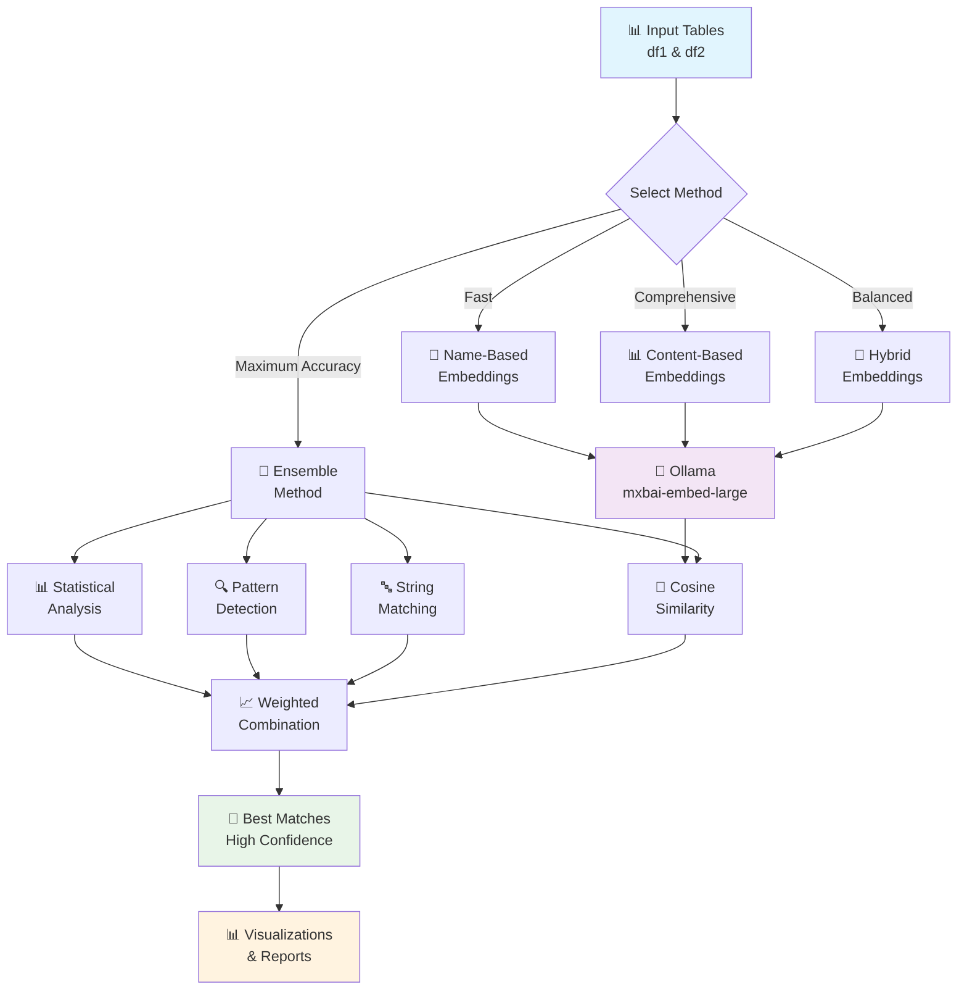
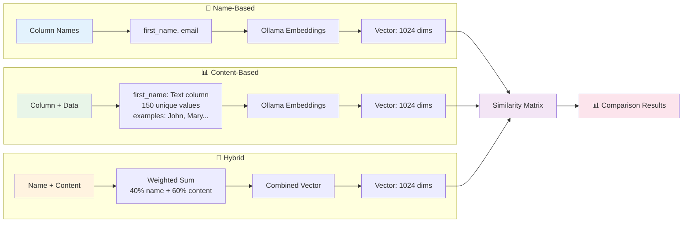
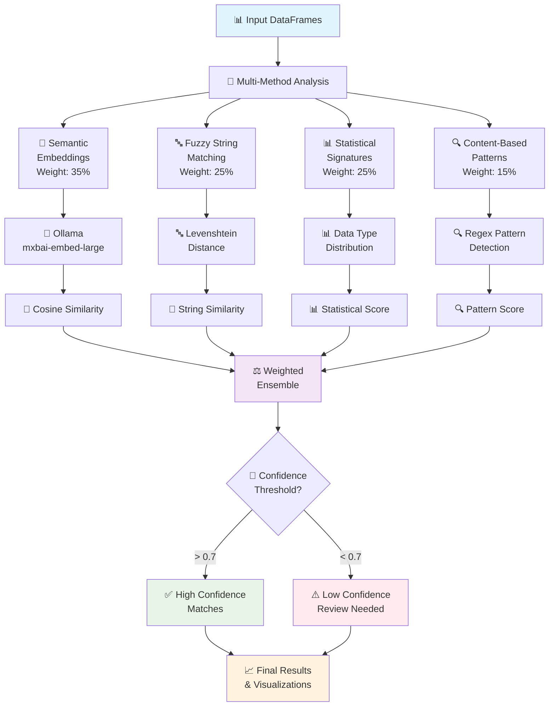
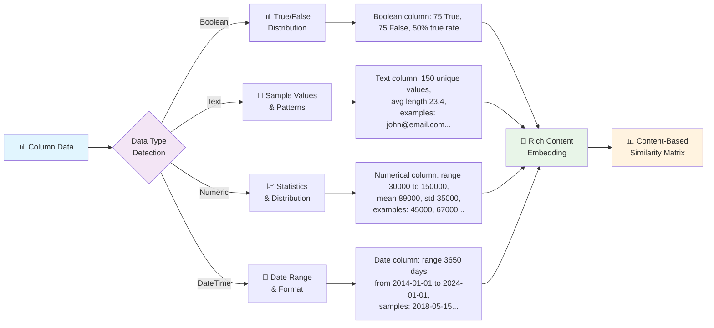
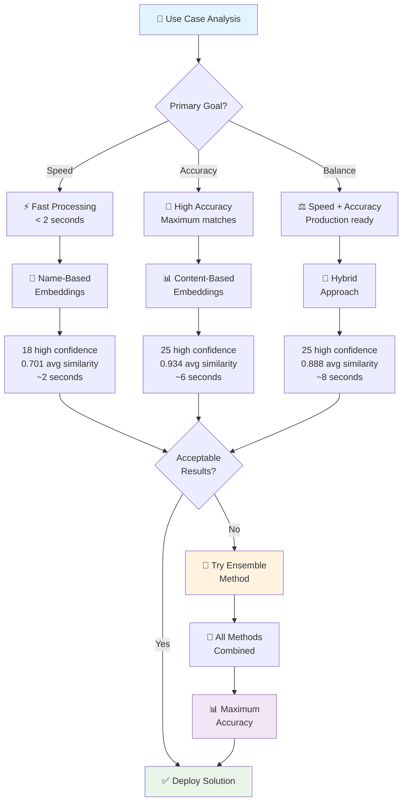
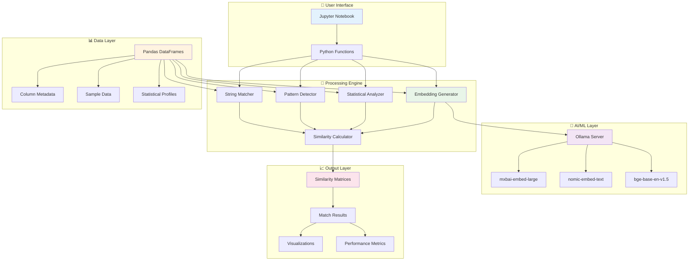
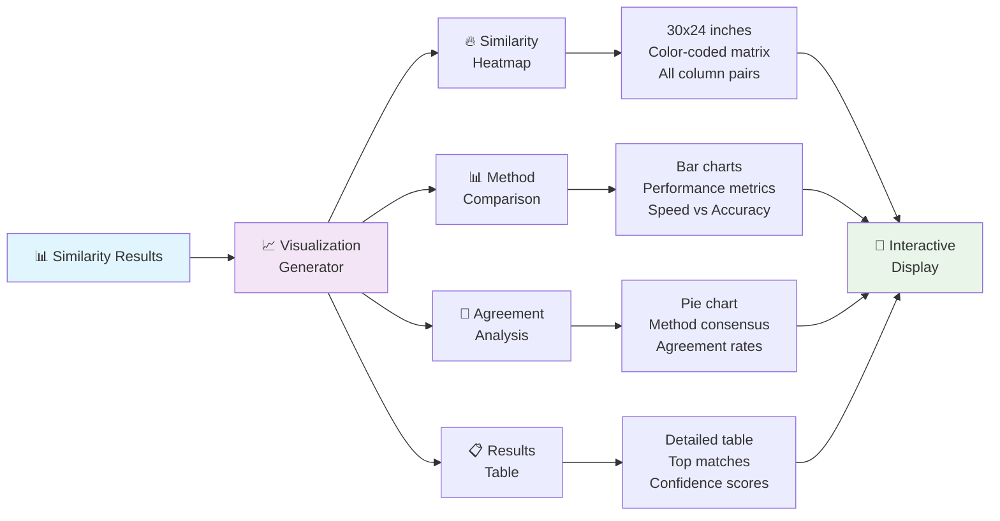
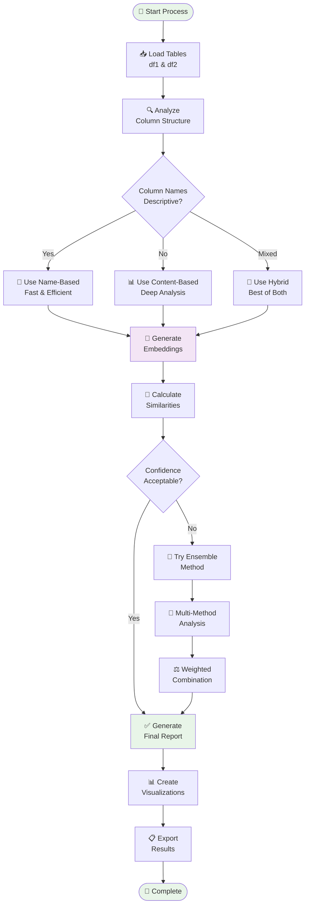

# 🔄 Table Comparison - Mermaid Flow Diagrams

This file contains Mermaid diagrams that visualize the table comparison workflow and architecture.

## 🎯 Overall Process Flow

## 🧠 Embedding Approaches Comparison

## 🎯 Ensemble Method Architecture

## 🔍 Data Content Analysis Pipeline

## 📊 Performance & Method Selection Flow

## 🔧 Technical Architecture

## 🎨 Visualization Pipeline

## 🔄 End-to-End Workflow

---

These diagrams provide visual documentation for:
- 👥 **Stakeholders**: Understanding capabilities
- 👨‍💻 **Developers**: Implementation guidance
- 📚 **Documentation**: Technical specifications
- 🎓 **Training**: Educational materials
